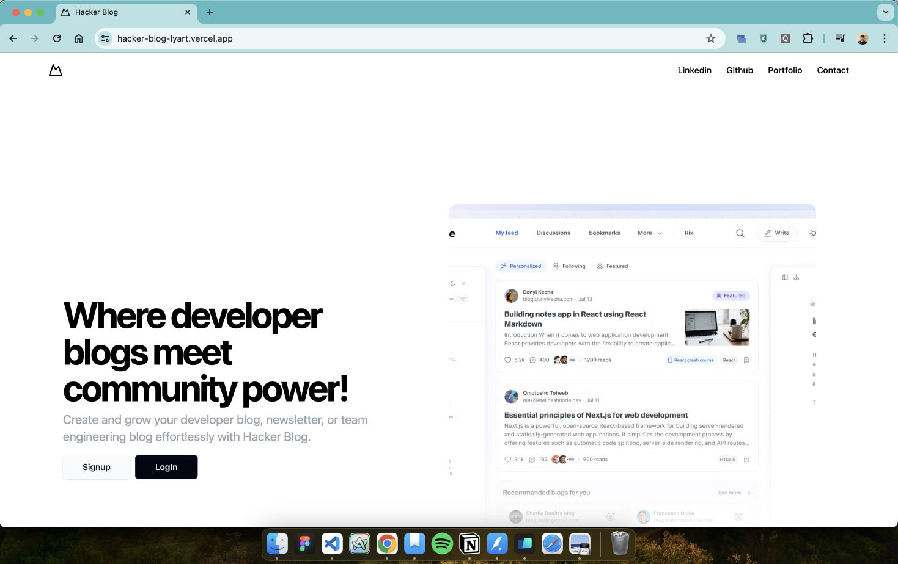

# Hacker Blog!

Hacker Blog is full-stack application designed to allow developers to create and grow their own developer blogs, newsletters, or team engineering blogs effortlessly.

### Todo
- [ ] Adding OAuth/Google
- [x] Save and retrieve date in posts
- [x] Add proper formating in blogs
- [x] Add related blogs under each post


## Installation and Setup

```
git clone https://github.com/akshatgoel07/hacker-blog.git
cd hacker-blog
```

### Backend (Cloudflare Worker + Postgres via Prisma)

1. `cd backend && npm install`
2. Copy the example config and fill in real values (kept out of git):
    ```
    cp .env.example .env                       # used by `prisma migrate`
    cp wrangler.example.toml wrangler.toml     # used at Worker runtime
    ```
   - `.env` needs a direct Postgres URL (e.g. Neon).
   - `wrangler.toml` needs a Prisma Accelerate URL for `DATABASE_URL`
     and a long random string for `JWT_SECRET`. For production, prefer
     `wrangler secret put DATABASE_URL` / `wrangler secret put JWT_SECRET`
     instead of writing them to `wrangler.toml`.
3. Apply migrations: `npx prisma migrate dev`.
4. Run locally: `npx wrangler dev src/index.ts --port 8787`.

### Frontend (Vite + React)

1. `cd frontend && npm install`
2. (Optional) `cp .env.example .env` if you plan to wire OAuth.
3. Start the dev server: `npm run dev` (defaults to <http://localhost:5173>).
4. The frontend reads the backend URL from `src/config.ts`. Default points
   at `http://localhost:8787`; flip the comment to use the deployed Worker.

> **Security note** — earlier commits in this repo's history contain real
> credentials (Neon connection string, Prisma Accelerate API key, Clerk
> secret, JWT secret). Anyone with access to the repo can read them. Rotate
> these credentials before relying on the project in any non-disposable
> environment.

## Tech Stack ⚙

### Frontend:
- React
- TypeScript

### Backend:
- Cloudflare Workers
- Zod (Validation Library)
- TypeScript
- Prisma (ORM with Connection Pooling)
- PostgreSQL Database
- JWT for Authentication

## Contact Information 📧
For any questions, feedback, or support requests, feel free to reach out to [akshathg7@gmail.com](mailto:akshathg7@gmail.com) 📧


## Screenshots 

